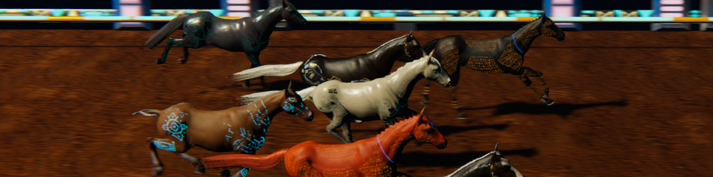

# Races in MetaHoof <!-- {docsify-ignore} -->

> The Ultimate Test of Strategy, Speed, and Stamina

## 1️⃣ The MetaHoof Racing Experience

MetaHoof introduces players to a **rich and dynamic racing ecosystem**, set in a **futuristic universe** where *
*high-tech tracks, advanced surfaces, and unpredictable weather conditions** shape the outcome of each race.

Races are **the heart of competition**, where players test their horses’ abilities against others in a variety of **race
types, formats, and conditions**. Every race is unique, influenced by a combination of:  
✅ **Horse traits and genetics** (speed, stamina, adaptability).  
✅ **XP progression and training impact** (race experience and growth).  
✅ **Energy levels and recovery mechanics** (how well a horse maintains form over multiple races).  
✅ **Track surfaces and weather conditions** (environmental adaptability).

A true champion in MetaHoof is **not just fast**, but **strategically bred, trained, and raced** under the right
conditions.

---

## 2️⃣ Race Types

MetaHoof races are **categorized based on distance**, requiring different strategies and horse attributes to succeed.

### 🏁 Sprint Races

✔ **Short-distance events**, where **explosive speed and quick acceleration** are key.  
✔ **Distance Range:** **1000m to 1600m**.  
✔ **Key Attributes:** **Speed & Acceleration**.

### 🏇 Middle-Distance Races

✔ **Balanced races** that require a **mix of speed and stamina**.  
✔ **Distance Range:** **1700m to 2400m**.  
✔ **Key Attributes:** **Balanced Speed & Endurance**.

### 🏆 Endurance Races

✔ **Long-distance challenges**, testing a horse’s **stamina, endurance, and energy management**.  
✔ **Distance Range:** **2500m to 3200m+**.  
✔ **Key Attributes:** **High Stamina & Consistent Pace**.

Every horse has **natural strengths**, but **training, breeding, and strategy** determine which race type they will
dominate.

---

## 3️⃣ Track Surfaces & Race Conditions
MetaHoof’s racing ecosystem features **diverse track surfaces**, each influencing **horse performance, racing strategy, and adaptability**. Selecting the **right horse for the right track** is essential to securing victory.

### 🔹 Track Surfaces

🏇 **Dirt Track** – The **classic, high-impact race surface**, designed for **pure speed and stamina endurance**.  
✔ **Description:** A natural surface that **tests a horse’s raw power and acceleration**.  
✔ **Performance Effect:**
- Horses with **strong acceleration and adaptability** excel.
- More resistant to **weather effects**, but may **slow horses in deep sections**.  
  ✔ **Best Suited for:** Horses with **balanced speed and stamina**.

🌱 **NanoTurf** – **Synthetic turf infused with nanotechnology**, dynamically **adjusting surface resistance** to create **an adaptive racing experience**.  
✔ **Description:** Embedded **nanobots** modify **surface conditions in real time**, offering **an ultra-modern, responsive track**.  
✔ **Performance Effect:**
- Horses with **high agility** benefit from **surface flexibility**.
- Slightly **reduces energy loss**, making it **ideal for longer races**.  
  ✔ **Best Suited for:** Horses with **agility and endurance as primary strengths**.

⚡ **ElectroGrid Track** – A **high-tech racing circuit**, featuring **electrically charged track zones**, demanding **agility and adaptability**.  
✔ **Description:** Integrated **conductive panels** create **charged track sections**, introducing **a reactive racing element**.  
✔ **Performance Effect:**
- Certain track areas **activate brief electrical pulses**, **boosting acceleration or challenging control**.
- Horses with **high adaptability and reaction speed** gain an edge.  
  ✔ **Best Suited for:** Horses with **quick reflexes, adaptability, and agility-based racing styles**.

Each track surface **alters racing strategy**, forcing players to **choose the best-suited horses** for each **race condition**.

### **🌩 Weather Conditions & Race Impact**
Weather can **dramatically alter race strategies**, impacting **track conditions and horse performance**.

☁ **Neon Fog** – **Reduces visibility**, adding **unpredictability and reaction-based challenges**.  
⛈ **ElectroStorms** – **Technologically induced storms** that may **interfere with race conditions**.  
🔥 **Thermal Waves** – **Extreme temperature shifts** that test **endurance and adaptability**.

Understanding **track compatibility and weather effects** is **key to winning races**.

---

## 4️⃣ Race Performance Mechanics

Every race in MetaHoof is **a dynamic event**, calculated using **horse stats, XP progression, energy levels, and
environmental conditions**.

### 📌 Key Factors Affecting Race Performance

**1️⃣ Horse Traits & Genetics**  
Each horse possesses **unique, inheritable traits**:  
🏎 **Speed** → Acceleration and top-speed ability (**critical for sprint races**).  
🏋 **Stamina** → Sustains speed over long distances (**crucial for endurance races**).  
⚡ **Agility** → Impacts a horse’s ability to **navigate track obstacles and adapt to weather**.  
🎯 **Adaptability** → Determines **how well a horse adjusts to unexpected race conditions**.

**2️⃣ XP Leveling & Performance Growth**  
🔹 **XP Levels** → As horses **race and earn XP**, they **level up**, improving **their base stats**.  
🔹 **Attribute Enhancement** → Higher XP levels **increase key traits** (speed, stamina, agility).  
🔹 **Race Specialization** → Horses may **develop enhanced abilities in specific race types** over time.

**3️⃣ Energy & Fitness**  
🏁 **Energy Bars (8 Total)** – Each race **consumes energy**, directly affecting performance.  
💪 **Fitness Level** – A horse’s fitness is **maintained through training sessions**, which are **managed by Trainers**.  
🔄 **Trainer Influence** – Specialized trainers **can enhance a horse’s fitness**, ensuring **optimal performance for consecutive races**.  
⚠ **Declining Fitness** – Without **proper training or maintenance**, a horse’s fitness **gradually depletes**, leading to **weaker performances**.

**4️⃣ Recent Form & Racing History**  
📊 **Recent Performance Trends** – Past **race results impact a horse’s expected performance**.  
📈 **Streak Influence** – **Winning streaks boost race confidence**, while **losing streaks may indicate fitness issues**.

---

## 5️⃣ Race Formats & Entry Requirements

MetaHoof offers **various race formats**, each with **specific rules and entry criteria**.

### 📌 Standard Race Formats

✔ **Winner Takes All (WTA)** → **1st place wins the entire prize pool**.  
✔ **Top 2 / Top 3 / Top 6** → Prizes are **split among the top finishers**.  
✔ **Double Up / Quadruple Up** → **Prize pools are shared** across multiple finishers.

### 📌 Special Race Formats

✔ **Qualifier Races** – Required to **unlock high-tier competitions**.  
✔ **Championship Races** – **Top-tier events** with **huge prize pools**.  
✔ **Team Events** – **Syndicate-based competitions**, where **players race as part of a team**.

Each format **tests different racing strategies**, making **stable management crucial for long-term success**.

---

## 6️⃣ Prize Distribution & Rewards

Every MetaHoof race offers **real value**, with **UOS-based prize pools, XP rewards, and leaderboard ranking points**.

### 🏆 Example Prize Distribution

| **Format** | **1st Place** | **2nd Place** | **3rd Place** | **4th - 6th** |
|------------|---------------|---------------|---------------|---------------|
| WTA        | **100%**      | -             | -             | -             |
| Top 2      | **60%**       | **40%**       | -             | -             |
| Top 3      | **50%**       | **30%**       | **20%**       | -             |
| Top 6      | **30%**       | **20%**       | **15%**       | **10% Each**  |

✔ **XP & Progression** – Even **non-winning horses** earn XP, ensuring **steady progression**.  
✔ **Race Entry Fees** – Certain races **require buy-ins**, increasing **prize pool value**.  
✔ **Special Rewards** – Certain events offer **rare NFTs, breeding perks, and stable enhancements**.

---

## 7️⃣ Shared Prize Mechanism & Sponsored Races

MetaHoof features **a community-driven prize structure**, ensuring that **players benefit from ecosystem growth**.

### 💰 Shared Prize Contributors

✅ **Race Fees & License Sales** → **A portion of revenue is redirected to major event prize pools**.  
✅ **Resells & Stud Offers** → **Marketplace transactions contribute to shared prize funds**.  
✅ **Breeding Fees** → **Profits from breeding cycles are reinvested into competitive racing incentives**.

### 📌 Sponsored Races Features

✔ **No Entry Fee** → Community-funded **prizes ensure accessible competitions**.  
✔ **Massive Payouts** → **Enhanced prize pools** encourage top-tier racing.  
✔ **Event Transparency** → **Publicly viewable funding ensures fairness**.

---
