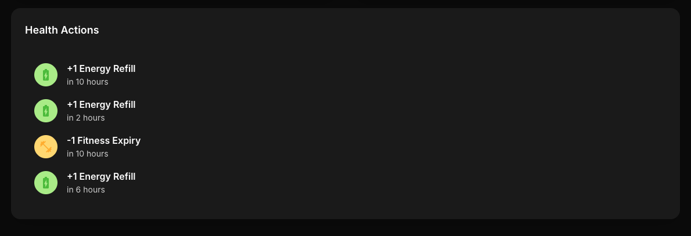

# 🏇 Energy Recovery & Management Guide

Managing your horse's energy is key to maintaining top performance and ensuring your stable dominates the racetrack. Let’s break down how energy works, how it recovers, and how you can optimize it for every race and training session.

## ⚡ What is Energy?

In MetaHoof, each horse has an **Energy Bar** consisting of multiple segments. These bars represent your horse’s stamina and readiness to participate in races or training sessions.

- **Each race or training will consume energy.**
- Some races may **require a minimum energy level** to enter.

## ⏳ Energy Recovery: How it Works

After completing a race or training session, your horse loses energy. Recovery happens gradually over time.

- 🕓 **1 Energy bar recovers every 4 hours.**
- Full recovery may take up to **20 hours**, depending on how much energy was consumed.

You can check your horse’s current energy and estimated recovery time by visiting the **Horse Details** page and looking under the **Health** section.

## 🧪 Using Energy Refill Items

To speed things up or prepare for an important race, you can use **Energy Refill items**.

- ✅ Instantly restores energy bars
- 🛠️ Perfect for competitive events or back-to-back races
- 💼 Refill items can be obtained through Season Pass rewards, marketplace, or special events

Use them strategically — don't waste them when you’re close to natural recovery.

## 🧠 Strategic Energy Management Tips

Here are some smart ways to manage energy like a pro:

### 1. **Plan Your Racing Schedule**

- Try to **spread out races** across the day.
- Avoid burning all energy at once unless you're aiming for a leaderboard push.

### 2. **Prioritize Important Races**

- Save energy for races that offer **high rewards or leaderboard points.**
- Enter casual races when you have spare energy.

### 3. **Time Your Training Sessions**

- Training also consumes energy but improves horse stats and fitness.
- Run light training sessions when energy is low, or time them before a refill.

### 4. **Monitor Recovery Timers**

- Use the **Health panel** to check how long until the next energy bar is restored.
- Set reminders if you're optimizing for peak race times.

### 5. **Use Refill Items Wisely**

- Save them for:
  - Tournament finals
  - Daily last-minute pushes
  - Big events or limited-entry races

## 💡 Final Tip

Energy = Strategy. Managing it smartly gives you a big edge in MetaHoof. Whether you’re racing for rewards or building up your horse’s skills in training, staying on top of your horse's energy ensures consistent progression and top-tier performance.
