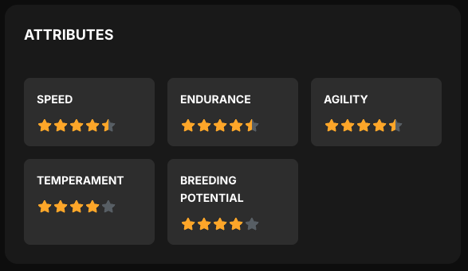

# 🐎 Understanding Horse Attributes in MetaHoof

Every horse in MetaHoof is born unique, with a combination of core attributes that directly impact how it performs on the track and in breeding. Knowing how these attributes work will help you make smarter decisions as a trainer, breeder, or racer.

## ⭐ ATTRIBUTE OVERVIEW

Each attribute is rated from 1 to 5 stars, including half-star increments. Here's what they mean for gameplay:

### 🏃 SPEED
**How fast your horse accelerates and maintains top velocity.**  
Affects performance in short sprints and fast-paced tracks.

- High speed = advantage in flat, straight tracks
- Crucial for burst racing strategies

### 💪 ENDURANCE
**Stamina and energy management over long distances.**  
Endurance determines how well a horse maintains performance in longer races.

- High endurance = less fatigue in long tracks
- Helps in strategic stamina-based builds

### 🌀 AGILITY
**Responsiveness and balance on turns and positioning.**  
Impacts handling in races with transctions and tactical positioning.

- High agility = smoother transitions
- Ideal for technical and strategical horses

### 😌 TEMPERAMENT

**Behavioral stability and focus under pressure.**  

Temperament affects how well the horse stays composed during crowded or chaotic races.

- High temperament = fewer penalties or missteps
- Important to follow strategies or reciver from chaotic starts

### 🌱 BREEDING POTENTIAL

**The likelihood of passing strong genetics to offspring.**  

While not directly used in races, it’s key to long-term stable strategy.

- High breeding potential = better foals
- Strategic for bloodline creation and trade

## 📈 How Attributes Affect Gameplay

- **Race Strategy:** Combining Speed + Endurance + Agility leads to optimal race builds.
- **Track Types:** Customize your roster to match specific track layouts.
- **Breeding Programs:** Plan breeding with traits in mind to build competitive bloodlines.
- **Training & Upgrades:** Some attributes can be boosted via trainers.

## 🔎 Tips for Players

- **Match horses to race types.** A high-speed horse may fail in long tracks without endurance.
- **Temperament is underrated.** It can decide the outcome in close races.
- **Balance matters.** A well-rounded horse often performs better than a one-trick pony.

Ready to test your champion? Join a race and see how these attributes play out!