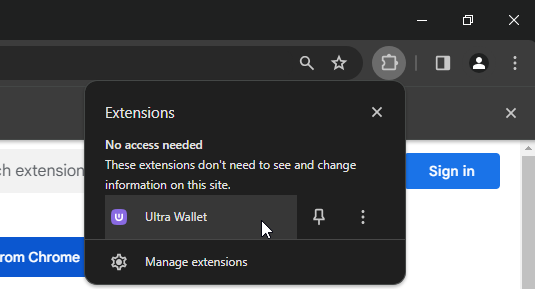
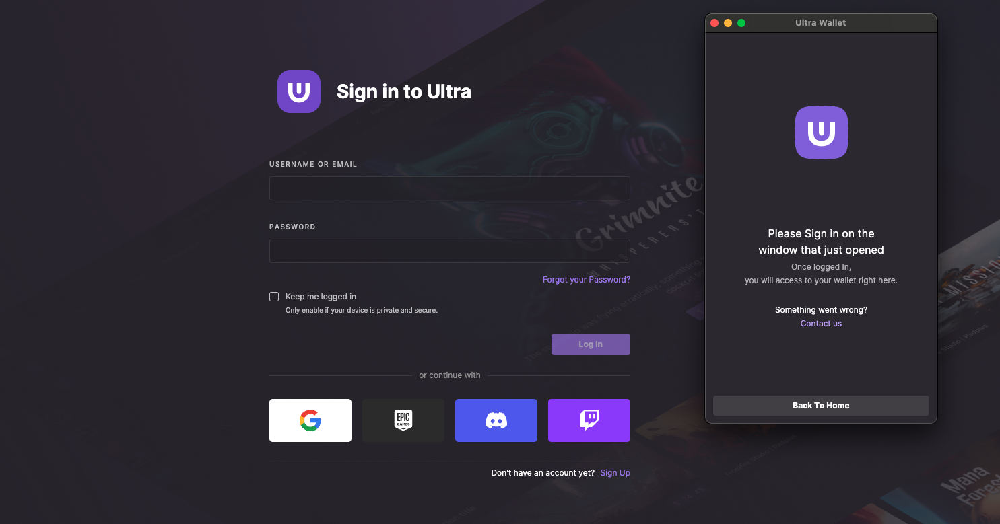
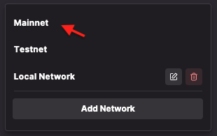
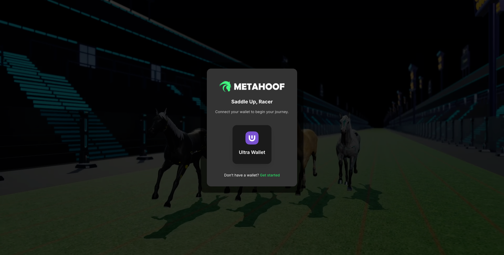
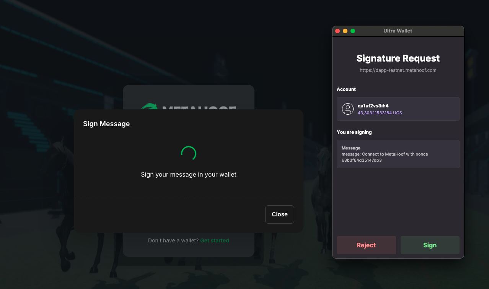

# Setup Ultra Wallet

Welcome to the world of Web3 gaming on Ultra! This quick guide will walk you through creating your Ultra account and setting up the Ultra Wallet browser extension. With this setup, you’ll be ready to connect to MetaHoof and explore the Ultra ecosystem seamlessly.

## 🌐 Prerequisites

- Use a Chromium-based browser such as **Google Chrome**, **Brave**, or **Microsoft Edge**.
- Ensure you have a stable internet connection.

## 🧩 Step 1: Install Ultra Wallet Extension

1. Open your Chromium browser.
2. Visit the [Ultra Wallet Extension Page](https://chromewebstore.google.com/detail/ultra-wallet/kjjebdkfeagdoogagbhepmbimaphnfln).
3. Click **“Add to Chrome”** and confirm the installation.

Once installed, you’ll see the Ultra Wallet icon in your extensions panel.

## 🧾 Step 2: Create Your Ultra Account

Don’t have an Ultra account yet? No worries—let’s set it up:

1. Click the Ultra Wallet extension icon to launch it.
2. Choose **“Sign Up”** and you'll be redirected to **Ultra SSO** (Single Sign-On).
3. Pick your preferred login method: **Email**, **Google**, **Twitch**, etc.

4. Complete the registration process. Your Ultra Wallet will automatically sync with your new account once it's verified.

> ✅ **Tip**: Already have an account? Just hit **“Sign In”** instead and use your Ultra credentials.

## 🔗 Step 3: Set the Network

Once logged in:

1. Open the Ultra Wallet.
2. Set your network to `Mainnet` (unless you're testing and need `Testnet`).

## 🎮 Step 4: Connect to MetaHoof

You're now ready to jump into the action!

1. Head over to [MetaHoof](https://play.metahoof.com).
2. Click **“Sign In”**.
3. The Ultra Wallet will pop up asking you to confirm the login request.

Confirm the operation, and you're in!

## 🎉 All Set!

You’ve successfully created your Ultra account, configured your wallet, and connected to MetaHoof. Now you’re ready to race, trade, and manage your digital assets like a pro. See you on the tracks!
