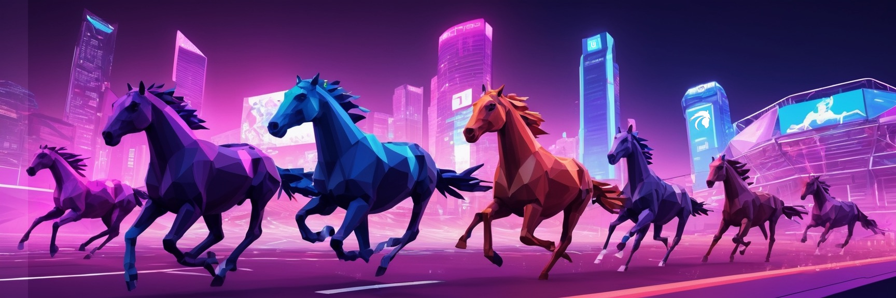

<h1 align="center">
   
  
   
  White Paper
   
</h1>

<h4 align="center">A thrilling NFT horse racing game on <a href="http://ultra.io" target="_blank">Ultra</a>
blockchain.</h4>

## Overview <!-- {docsify-ignore-all} -->

**MetaHoof** is an exclusive digital horse racing game built on the Ultra.io blockchain. This game combines the
excitement and strategy of traditional horse racing with the cutting-edge
technology of blockchain, offering players a unique, transparent, and engaging experience. Each digital horse in
MetaHoof is represented as a Non-Fungible Token (NFT), ensuring uniqueness and true ownership. Players can own, breed,
and race these horses, participating in a vibrant in-game economy and community.

**Key Elements:**

- **Exclusive Ultra Platform:** MetaHoof is exclusively available on the Ultra blockchain, providing a unique gaming
  experience tailored for the Ultra community.
- **Ownership and NFTs:** Players fully own their digital horses as NFTs, allowing for secure trading, selling, and
  showcasing.
- **Breeding and Genetics:** The breeding system enables players to create new horses with inherited traits, adding a
  layer of strategy and rarity.
- **Racing Competitions:** Engage in various race formats and events, testing the skills and attributes of your horses
  against others.