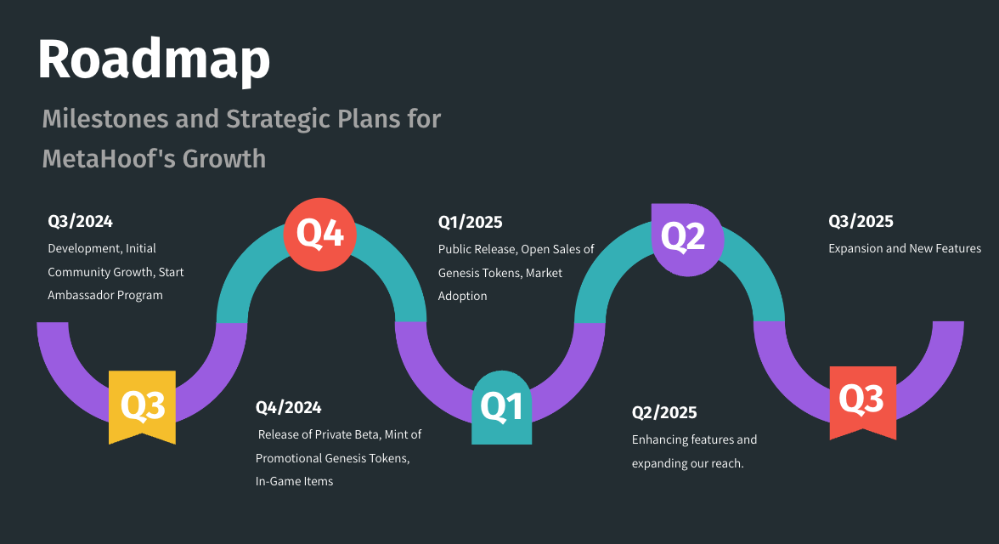

## Roadmap

MetaHoof is dedicated to a structured and strategic approach to growth, development, and community engagement. Below is
a detailed roadmap outlining the key milestones and strategic plans for MetaHoof's growth over the next few years.

### Q3 2024

- **Development and Initial Community Growth**
    - **Objective:** Build and establish the foundation of MetaHoof, focusing on the core features and initial community
      outreach.
    - **Key Activities:**
        - Development of the MetaHoof platform.
        - Initial community growth initiatives.
        - Launch of the Ambassador Program to attract and engage key influencers and community leaders.

### Q4 2024

- **Release of Private Beta and Minting of Promotional Genesis Tokens**
    - **Objective:** Test the platform with a select group of users and mint the first batch of Genesis Tokens to build
      excitement and initial user base.
    - **Key Activities:**
        - Release of the private beta version of MetaHoof.
        - Minting and distribution of promotional Genesis Tokens.
        - Introduction of in-game items to enhance user engagement and experience.

### Q1 2025

- **Public Release and Open Sales of Genesis Tokens**
    - **Objective:** Officially launch MetaHoof to the public and initiate open sales of Genesis Tokens to drive market
      adoption.
    - **Key Activities:**
        - Public release of the MetaHoof platform.
        - Open sales of Genesis Tokens to the broader community.
        - Marketing campaigns to increase awareness and adoption.

### Q2 2025

- **Enhancing Features and Expanding Our Reach**
    - **Objective:** Improve existing features and expand the platform’s reach to attract more users and enhance user
      experience.
    - **Key Activities:**
        - Continuous enhancement of platform features based on user feedback.
        - Expansion of community engagement initiatives.
        - Strategic partnerships to increase platform visibility and user base.

### Q3 2025

- **Expansion and New Features**
    - **Objective:** Introduce new features and expand the platform to accommodate a growing user base.
    - **Key Activities:**
        - Development and release of new features to keep the platform innovative and engaging.
        - Expansion into new markets and regions to grow the user base.
        - Enhanced marketing and community-building efforts to sustain growth.

### Q4 2025

- **Introduction of Advanced Racing Formats and Gamification**
    - **Objective:** Implement advanced racing formats and gamification elements to increase user engagement and
      retention.
    - **Key Activities:**
        - Introduction of new racing formats such as tournaments, leagues, and special events.
        - Integration of gamification elements like achievements, leaderboards, and seasonal rewards.
        - Enhancement of the breeding and genetics system to provide deeper strategic gameplay.
        - Continued expansion and optimization based on user feedback and market trends.

## Strategic Focus Areas

#### Community Engagement

- **Ambassador Program:** Attract and engage influential community members to promote MetaHoof and build a loyal user
  base.
- **User Feedback:** Regularly collect and analyze user feedback to continuously improve the platform and user
  experience.

#### Platform Development

- **Feature Enhancement:** Continuously improve platform features based on user feedback and market trends.
- **Scalability:** Ensure the platform can scale effectively to accommodate a growing number of users and transactions.

#### Market Adoption

- **Token Sales:** Strategically manage the sale and distribution of Genesis Tokens to ensure a healthy and vibrant
  market.
- **Marketing Campaigns:** Implement targeted marketing campaigns to increase awareness and drive user acquisition.

#### Innovation

- **New Features:** Regularly introduce new features to keep the platform innovative and engaging.
- **Strategic Partnerships:** Forge partnerships with key stakeholders to enhance platform capabilities and reach.
