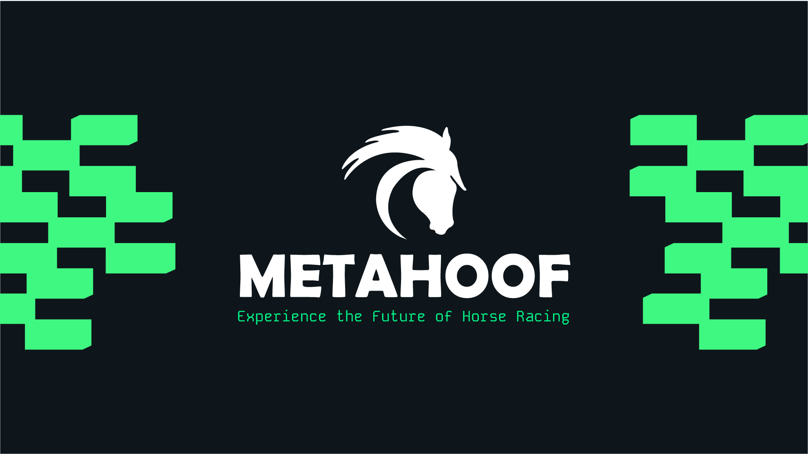

# Introduction <!-- {docsify-ignore-all} -->

**MetaHoof** is an exclusive digital horse racing game that brings the thrill of traditional horse racing into the modern
age with the power of blockchain technology. Built on the **[Ultra.io](https://ultra.io) blockchain**, MetaHoof creates
a dynamic, immersive
world where players can engage in races, breed champion horses, and build a thriving in-game economy. By integrating **Non-Fungible Tokens (NFTs)**, MetaHoof ensures that each horse is a one-of-a-kind digital asset, granting players true
ownership and the ability to trade or sell their prized steeds.

Players can dive into the exciting world of MetaHoof by taking on various roles within the ecosystem: **owners**, **breeders**, and **trainers**. Whether you're racing your horses to victory in high-stakes tournaments, breeding for the
next champion, or strategically managing your stable, the game offers endless possibilities for engagement and fun. The
inclusion of blockchain technology means that every race, every breeding decision, and every transaction is secure,
transparent, and verifiable, ensuring a truly player-driven experience.

At its core, MetaHoof blends **strategy**, **competition**, and **community**. Players can participate in both **casual
and competitive racing events**, train their horses to improve their performance, and interact with a global community
of passionate players. Whether you're an experienced gamer or a horse racing enthusiast, MetaHoof offers a fresh,
exciting way to experience the sport in the digital world.

## Key Elements

- **Exclusive Ultra Platform**: MetaHoof is exclusively available on the **Ultra blockchain**, providing a unique and
  seamless gaming experience optimized for the Ultra community. Players can take advantage of Ultra’s fast, secure, and
  scalable infrastructure.

- **Ownership and NFTs**: Every horse in MetaHoof is represented as a **Non-Fungible Token (NFT)**, ensuring that
  players have true ownership over their assets. Horses can be traded, sold, or showcased within the game’s marketplace,
  giving players control and flexibility over their digital investments.

- **Breeding and Genetics**: The breeding system is at the heart of MetaHoof, allowing players to create new horses by
  combining inherited traits from parent horses. This adds a layer of strategy, as players can selectively breed for
  desirable attributes like speed, stamina, and rarity, making each horse unique.

- **Racing Competitions**: Players can compete in a variety of **race formats and events**, from casual sprints to
  high-stakes tournaments. The performance of each horse is influenced by its stats, training, and breeding lineage,
  providing a dynamic and competitive racing experience.

- **Dynamic In-Game Economy**: MetaHoof offers a thriving, player-driven economy where horses, breeding rights, and
  other assets have real-world value. Players can earn rewards through racing, breeding, and trading, creating an
  exciting play-to-earn model.

- **Community Engagement**: MetaHoof isn’t just a game—it’s a community. Players can interact, trade horses, join
  events, and collaborate with others. Whether through competitions or governance, the community has a voice in shaping
  the future of MetaHoof.

## Mission and Vision

**Mission:** The mission of MetaHoof is to deliver a premier digital horse racing experience that is both entertaining
and rewarding. We aim to provide a fair, transparent, and engaging platform where players can fully own and control
their digital assets, while also fostering a strong, passionate community on the Ultra blockchain.

**Vision:** Our vision is to become the leading digital horse racing game on the blockchain, known for its innovation,
fairness, and community focus. We strive to create a sustainable and dynamic ecosystem where players can enjoy strategic
gameplay, participate in a thriving economy, and engage with a dedicated community.

## The Problem & How MetaHoof Solves It

#### The Problem

1. **Lack of True Ownership in Digital Games**  
   Many digital games today operate in a traditional model where players can buy in-game items, skins, or assets, but
   they don’t truly own them. These items are often locked behind walled gardens and cannot be traded or sold outside
   the game’s ecosystem. Players are left with no real control over the assets they’ve spent time and money on.

2. **Limited Interoperability Between Games**  
   In the current gaming landscape, digital assets are often confined to a single game. There’s no way for players to
   take their hard-earned items or characters across different games or platforms. This limits the value and utility of
   in-game assets, leaving players with few long-term incentives.

3. **Barriers to Entry in Horse Racing**  
   Horse racing, a sport that has long been associated with luxury, is difficult to access for most people due to the
   high costs of owning and maintaining racehorses. Moreover, traditional racing is often seen as inaccessible to the
   everyday player, limiting opportunities for fans to participate and compete.

4. **Opacity in In-Game Economies**  
   Many games today operate on closed, centralized economies with little transparency. Players don’t always understand
   how the in-game economy works, and the true value of assets is often difficult to assess. This can create frustration
   and mistrust among players.

5. **Limited Earning Potential in Traditional Gaming**  
   In traditional gaming, players invest significant amounts of time, effort, and sometimes money into their gaming
   experience, but without tangible rewards. The idea of play-to-earn has been underdeveloped, and many players seek new
   ways to generate value from their gaming time.

---

#### How MetaHoof Solves It

1. **True Ownership Through NFTs**  
   MetaHoof solves the problem of ownership by integrating **Non-Fungible Tokens (NFTs)** into the gameplay. Each
   digital horse, track, and other in-game assets are represented as NFTs, ensuring that players have true ownership
   over their assets. These NFTs are secure, tradable, and can be sold on the open market, giving players control and
   flexibility over their investments. This provides players with a sense of real-world value and ownership that is
   often missing from traditional games.

2. **Interoperability and Flexibility with Blockchain**  
   Thanks to the **Ultra.io blockchain**, MetaHoof ensures **true interoperability**. Horses, equipment, and other
   assets are not locked into the MetaHoof universe alone. The blockchain infrastructure allows for the seamless
   exchange and trade of assets, potentially enabling their use in other Ultra-based games or platforms. This makes each
   digital asset more valuable and offers players greater flexibility in how they use, trade, or display their NFTs.

3. **Accessible Horse Racing for All**  
   MetaHoof democratizes access to horse racing by eliminating the barriers to entry that have traditionally kept many
   people away from the sport. Players don’t need to spend vast amounts of money to own a real racehorse. Instead, they
   can buy, breed, and race digital horses within an engaging and accessible digital ecosystem. This opens the door for
   players from all walks of life to participate, compete, and enjoy the thrill of the race.

4. **Transparent, Player-Driven Economy**  
   MetaHoof’s blockchain-powered economy is transparent and secure. Every transaction is recorded on the blockchain,
   giving players full visibility into how the economy operates and the value of their assets. This level of
   transparency fosters trust and confidence in the game’s financial systems, allowing players to make informed
   decisions about how to manage and grow their assets.

5. **Play-to-Earn Model**  
   MetaHoof introduces a fully integrated **play-to-earn system** that allows players to generate real-world value from
   their time spent in the game. Players can earn rewards through racing, breeding, and trading horses. The game’s
   economy is designed to provide players with continuous opportunities to earn, whether it’s from winning races,
   selling horses, or participating in special events and tournaments. By blending gaming with the potential for real
   economic gain, MetaHoof elevates the player experience to new heights.

## Target Audience

MetaHoof is designed to appeal to a diverse range of users, including:

- **Ultra Community Members**: Players who are part of the Ultra platform and are looking for exclusive, high-quality gaming experiences that take full advantage of Ultra’s blockchain capabilities.

- **Gamers and Strategists**: Individuals who enjoy competitive gameplay, strategic planning, and the thrill of racing. MetaHoof offers deep mechanics for those who want to refine their skills, develop winning strategies, and compete at the highest levels.

- **Horse Racing Fans**: Fans of the traditional sport who are excited to engage with the horse racing world in a digital format. MetaHoof offers a fresh, interactive way to experience the excitement of races, breeding, and competition.

- **Blockchain Enthusiasts and NFT Collectors**: People who are passionate about the potential of blockchain technology and Non-Fungible Tokens (NFTs). MetaHoof provides a unique opportunity to own, trade, and invest in digital assets with real-world value.

- **Investors**: Individuals seeking unique digital assets with potential for long-term value appreciation. The MetaHoof ecosystem offers opportunities to invest in valuable player-owned horses, tracks, and other digital assets. Additionally, investors can explore advertising opportunities within the game, tapping into a growing player base and creating an alternative revenue stream through branded in-game events, sponsored races, and digital billboards, all while leveraging the reach of a passionate and engaged community.
