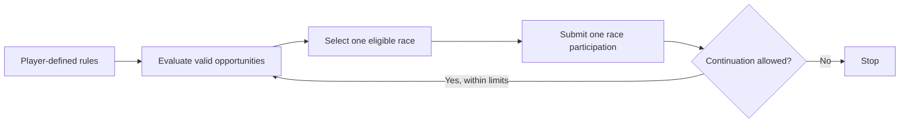

# Agent Layer

## 1. The Role of Agents

The Agentic Participation Layer exists to enable structured participation in MetaHoof. Agents allow players to execute predefined strategies with greater consistency and less manual repetition, especially when managing multiple horses across competitive environments.

Their role is operational, not autonomous. Players remain the decision-makers: they choose the horses, define the strategy, set the conditions for participation, and determine the boundaries within which an agent may act.

Agents do not replace gameplay. They extend a player's ability to carry out gameplay decisions inside the rules of the system.

## 2. From Strategy to Execution

The agent layer begins with player intent. Players decide:

- which horses to use
- where those horses are allowed to participate
- how strategic behavior should be configured

Agents use those inputs to execute participation. They interpret player-defined rules against current system conditions, evaluate valid opportunities, and submit race entries where permitted.

This keeps authority with the player while shifting repetitive operational steps into a controlled execution layer.

| Player defines | Agent executes |
| --- | --- |
| Which horses may be used | Evaluates only assigned and eligible horses |
| Which races or environments are allowed | Filters only valid opportunities within those rules |
| Which strategy profile should apply | Submits participation using the configured strategy |
| When participation should stop | Stops or continues only within explicit bounded limits |

## 3. Discrete Execution Model

MetaHoof agents operate in discrete cycles. Each cycle corresponds to one race participation.

A cycle consists of:

- evaluating available opportunities
- selecting a valid race
- submitting entry

After that execution, the agent must either stop or continue only if explicit and bounded continuation conditions have been defined.

This distinction is central to the design. MetaHoof agents are not continuous systems, background automation loops, or set-and-forget optimizers. They are execution systems that act one participation cycle at a time within defined limits.

> How to read this layer: the player defines intent once, but the agent still executes only one participation cycle at a time and remains subject to stopping conditions after each cycle.

## 4. Bounded Continuation

An agent may continue beyond a single cycle only when continuation has been explicitly allowed and when all relevant constraints remain satisfied.

Examples of bounded continuation include:

- a limited number of races
- energy or readiness thresholds
- participation caps

Continuation is always controlled. It is never open-ended, and it is never allowed to operate outside explicit player or system limits.

## 5. Constraints and Limits

Agents are always bound by the same structural constraints that govern player participation. These include:

- energy and readiness systems
- race eligibility rules
- entry costs
- participation limits

Agents cannot bypass these constraints. They cannot enter restricted races, ignore readiness requirements, exceed participation caps, or operate without sufficient resources.

These limits are necessary to prevent infinite scaling and to preserve pacing, fairness, and meaningful decision-making within the game.

## 6. Economic Boundaries

MetaHoof agents are execution systems, not autonomous economic actors. They do not generate value independently, they do not guarantee returns, and they do not operate as abstract resource managers detached from gameplay.

Their function is to carry player intent into the racing economy under valid conditions. Participation is still required, and outcomes remain uncertain because they depend on competition, race selection, readiness, and strategic deployment.

This ensures that agent activity remains part of the game rather than a separate system operating above it.

## 7. Player Re-Engagement

Agents do not remove the need for player re-engagement. Players still need to review outcomes, adjust strategies, reassign horses, and decide when and where assets should be redeployed.

Because agents operate within bounded cycles and rule-defined conditions, they support ongoing decision-making rather than replacing it. The player remains responsible for adapting to changing circumstances and competitive results.

## 8. Strategic Depth

Success in MetaHoof depends on more than execution alone. Players must choose appropriate economic environments, configure strategies carefully, time participation effectively, and manage horse readiness over time.

Agents help carry out those decisions, but they do not replace the thinking behind them. Strategic depth remains with the player because the system preserves uncertainty, tradeoffs, and the need for selective deployment.

## 9. System Integrity

The Agentic Participation Layer is designed to increase participation efficiency while preserving fairness and unpredictability. It allows players to operate more consistently without removing the competitive structure that gives the game meaning.

MetaHoof agents are execution systems, not autonomous economic actors. The system is built to ensure that there is no infinite automation, no single dominant strategy, and no guaranteed outcome from agent use alone.
