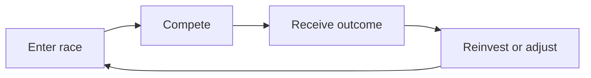
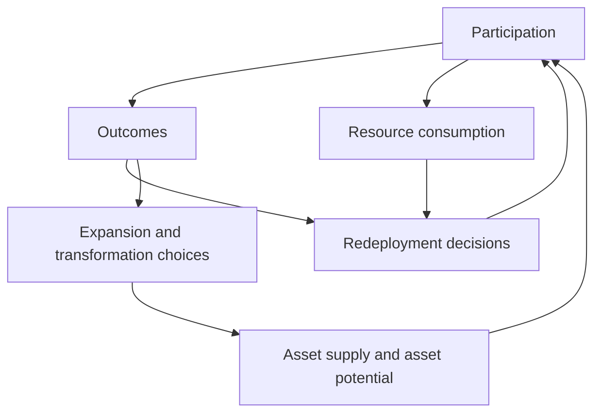

# Economic Loops

## 1. Overview of Economic Loops

MetaHoof operates through a set of interconnected economic loops rather than a single linear progression path. These loops drive participation, circulate value through competition, and shape how assets evolve over time.

No loop exists in isolation. Racing, deployment, expansion, transformation, and resource consumption all depend on player participation and all affect one another. The economy remains active only when players continue to deploy assets, make decisions, and accept competitive outcomes.

| Loop | Primary purpose | Depends on |
| --- | --- | --- |
| Core participation loop | Create competitive outcomes and redistribute value | Race entry and contested performance |
| Deployment loop | Put assets into play manually or through agents | Player intent and valid opportunities |
| Delegation and pooling loop | Route delegated assets into system participation | Pool coordination, agents, and real activity |
| Expansion loop | Introduce new supply under controlled conditions | Resource cost and system rules |
| Transformation loop | Change asset potential and create progression tradeoffs | Resource consumption and player choice |
| Resource consumption loop | Regulate scale and preserve balance | Costs, readiness, and sink mechanisms |

## 2. Core Participation Loop

The fundamental loop of MetaHoof is:

enter race -> compete -> receive outcome -> reinvest or adjust

This is the primary loop of the system. It is the point at which horses are deployed, value is committed through entry, outcomes are determined, and players decide what to do next.

All primary value flow originates here. If races are not being entered, value is not being committed, redistributed, or recirculated through the game. No participation means no primary economic activity.

## 3. Deployment Loop (Agents and Manual Play)

Assets are deployed into the system through repeated participation. Players may do this manually, or they may use agents to execute participation within player-defined rules.

In both cases, the loop is the same: a horse is selected, a race is entered, an outcome is produced, and that outcome feeds back into future decisions about timing, readiness, race selection, and strategy.

Agents do not create a separate economic loop. They increase the efficiency and consistency of an existing one by executing participation cycles on behalf of the player. Each agent cycle remains tied to discrete race participation and feeds back into the same decision-making process as manual play.

## 4. Delegation and Pooling Loop

MetaHoof also supports a delegation and pooling loop:

delegation -> pooling -> participation -> outcome -> redistribution -> reallocation

This loop extends the core participation loop rather than replacing it. Players can delegate horses into a system-controlled participation layer, where assets are grouped into pools that coordinate how participation is distributed across the system.

The loop begins with delegation. A player allocates a horse to the system and defines high-level participation intent within the allowed rules. That horse is then grouped into a pool, where system-managed participation can be organized across valid opportunities.

Participation still depends on active execution. Agents execute participation cycles on behalf of delegated assets, and those cycles remain discrete, bounded, and subject to the same system constraints that govern the rest of the economy. Assets may enter races or other valid system activities only when conditions allow it.

From there, outcomes are produced through actual participation. Performance and activity generate results, and value is redistributed according to participation, performance, and other system-defined factors. The player may then reallocate by keeping the asset in the pool, withdrawing it, or changing how participation is configured.

This loop does not create value independently, does not guarantee rewards, and does not operate outside the broader economic structure. It depends on racing activity, agent execution, and real system participation. Without those, the loop produces no value.

Delegated assets also remain bound by the same limits as any other deployed asset, including energy and readiness rules, eligibility requirements, and participation caps.

## 5. Expansion Loop (Breeding and Asset Creation)

Supply evolves through controlled expansion mechanisms that introduce new horses into the economy over time. This expansion is conditional and resource-dependent rather than automatic.

New asset creation changes the broader system by increasing the number of horses competing for outcomes. That introduces additional competition, creates dilution pressure, and forces more selective strategic deployment across different environments.

Because expansion is constrained, supply growth is part of system balance rather than an unrestricted growth path. It adds long-term dynamism while preserving the need for cost, timing, and participation decisions.

## 6. Transformation Loop (Rupture System)

MetaHoof also includes transformation-oriented progression loops, including systems such as the Rupture System, where assets can be modified or evolved through resource-consuming actions.

This loop is important because transformation is not only a progression path. It also acts as a resource sink and a differentiation layer. Players choose whether to commit resources toward changing asset potential, and those choices affect future deployment decisions.

Transformation therefore links progression to economic tradeoffs. It consumes inputs, changes how an asset may be used later, and creates further variation in how players structure participation over time.

## 7. Resource Consumption Loop

Every major loop in MetaHoof consumes resources. Participation uses entry fees and readiness capacity. Expansion requires time and cost. Transformation consumes dedicated inputs and other system resources.

This consumption is necessary for economic stability. It regulates activity, prevents infinite scaling, and ensures that repeated participation always carries tradeoffs.

Without meaningful consumption, loops would expand without friction and the system would lose balance. Resource use is therefore not incidental to the economy; it is one of the mechanisms that keeps the economy functional.

## 8. Feedback Between Loops

The economic loops in MetaHoof continuously feed into one another. Participation generates outcomes. Outcomes influence whether players redeploy, pause, expand, or transform assets. Expansion increases competitive density. Resource consumption limits how far each loop can run before new decisions are required.

This interdependence is important. A change in one loop affects the others. Higher participation changes prize competition. Supply expansion affects race environments. Resource constraints regulate how quickly players can cycle back into further activity.

The system is therefore governed by feedback, not isolated mechanics.

## 9. Role of Agents in Economic Loops

Agents participate in these loops by executing race-entry cycles on behalf of players. They help keep horses moving through the participation loop with greater consistency, but they do not create new value streams and they do not alter the underlying structure of the economy.

Agents cannot bypass costs, ignore readiness rules, avoid eligibility requirements, or operate outside bounded limits. They remain dependent on the same loops as manual play: resources must still be committed, races must still be valid, and outcomes remain uncertain.

Their role is to increase participation consistency inside the existing system, not to create a parallel system.

## 10. Loop Stability

Long-term stability depends on the balance between participation and consumption, controlled expansion of supply, and the consistent enforcement of system constraints.

The loops are designed to avoid runaway inflation, prevent any single approach from dominating indefinitely, and maintain competitive dynamics across different environments. Stability comes from the interaction between value circulation, resource sinks, constrained growth, and bounded participation.

Value in MetaHoof emerges from repeated participation across interconnected loops. It does not come from passive holding, isolated mechanics, or guaranteed cycles of return.
